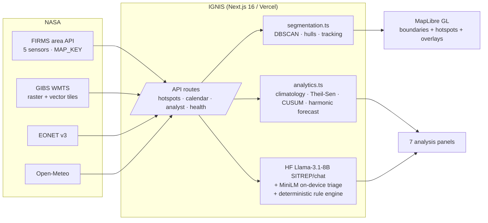

<div align="center">


### One 26-year burning-activity record from NASA's split MODIS + VIIRS archive — organized, segmented, and turned into early warning.

**NASA Space Apps Challenge 2026 — Challenge #9: *Harmonization of MODIS and VIIRS Hot Spots***

[](https://nextjs.org) [](https://firms.modaps.eosdis.nasa.gov) [](https://huggingface.co/Nabidnur/ignis-fire-calendar) [](https://www.typescriptlang.org) [](LICENSE) [](docs/SECURITY.md) [](#run-locally)

**Live app:** [ignis-spaceapps2026.vercel.app](https://ignis-spaceapps2026.vercel.app) · **Model family:** 4 custom models on [Hugging Face](https://huggingface.co/Nabidnur/ignis-fire-regime-model) · **Dataset:** [Nabidnur/ignis-fire-calendar](https://huggingface.co/datasets/Nabidnur/ignis-fire-calendar)

> 🔐 *This is the **official public submission repository**: a fully sanitized snapshot of the development tree. It contains **no API keys, tokens, or credentials of any form** — all keys are read from environment variables (`.env.example` documents every name), git history is a fresh single audited commit, and the app **runs with zero keys** thanks to the key-free GIBS fallback. Full hygiene policy: [docs/SECURITY.md](docs/SECURITY.md).*

</div>

---

## Why IGNIS exists

NASA's two flagship fire instruments are split across two eras and two scales: **MODIS (1 km, Terra 2000 + Aqua 2002)** and **VIIRS (375 m, S-NPP 2012, NOAA-20 2018, NOAA-21 2023)**. A fire small enough for VIIRS to see can be invisible to MODIS — so the *same* landscape produces wildly different detection counts depending on which satellite you ask. That split record breaks any long-term fire-activity analysis: 26 years of MODIS cannot be compared to 14 years of VIIRS without harmonization.

IGNIS answers the challenge statement with a **single, continuous, calibrated Burning Activity Calendar** (2000 → today), then layers everything an early-warning user actually needs on top: **boundary-identified fire clusters**, **persistent-system tracking**, **daily dynamics**, **fire-weather fusion**, and a **grounded AI analyst** that writes incident-style situation reports.

## What makes IGNIS different

| | Typical approach | IGNIS |
|---|---|---|
| Record | Live points only, one sensor era | **26-year harmonized calendar** (9 regions + Bangladesh, precomputed from GIBS archive) |
| Map output | Point cloud | **DBSCAN segmentation → convex-hull fire boundaries**, classified MEGAFIRE / ESTABLISHED / EMERGING / SCATTERED |
| Time | Snapshot | **7-day replay with persistent fire-system tracking** (nearest-centroid, FRP trend) |
| AI | One chat box | **Grounded SITREP generator + cluster explanations**, zero-hallucination guard, deterministic rule-engine fallback, MiniLM on-device triage |
| Honesty | Hidden fallbacks | Every panel shows its **data source, pipeline note and uncertainty** (continuity ratio CV, R², GIBS vector lag) |
| Fallback | None — API down = app down | **Dual-path**: FIRMS area API primary → GIBS WMTS vector-tile parser fallback (works even where FIRMS is blocked) |

## The eight screens

1. **🔥 Burning Calendar** — 26-year × 12-month heatmap per sensor, unusual-month rings (|z| ≥ 2), FRP bars, click any month to load it on the map. Includes the **continuity coefficient** (median VIIRS/MODIS overlap ratio) and its CV as an honesty readout.
2. **🧪 Fire Cluster Lab** *(new)* — in-browser **DBSCAN segmentation** (ε adaptive to AOI, grid-accelerated) + **convex-hull boundaries** (Andrew monotone chain). Cluster table with ΣFRP, spread, hull area, **front-ratio** (elongation = advancing fire front), night share, sensor mix. **FRP distribution histogram** (log bins), **diurnal signature** (UTC acquisition hours, orbit detection), and **persistent fire systems** tracked across the replay window.
3. **📊 Daily Dynamics** *(new)* — stacked per-sensor daily detections, fire radiative **energy curve**, **MODIS↔VIIRS cross-validation scatter** against the 1:1 line (the harmonization problem in one chart), day/night balance, deterministic verdict (ESCALATING / DECLINING / STEADY).
4. **📈 Time-Series Lab** — STL-style decomposition, Theil-Sen robust trend, CUSUM change points, climatology z-scores.
5. **🔭 Seasonal Outlook + 🧭 Burn Regime** — harmonic (Fourier) regression forecast in log-space with residual bands, and nearest-prototype classification against 8 NASA-derived reference regimes.
6. **🤖 Open Science** *(new)* — live view of IGNIS's public Hugging Face assets, fetched from the Hub at runtime: the **fire-complex segmentation model** (DBSCAN+KMeans trained on 138k real FIRMS detections; open weights + full training script + metrics) and the **26-yr harmonized calendar dataset** (long-format CSV, regime matrix, **calibrated FRE→CO₂e emissions estimates**, complex inventories) with a datasets-server row preview.

Plus: **live map** (FRP-sized glowing hotspots, white cores ≥ 150 MW, 4 color modes, hexbin density, GIBS true-color / 7-2-1 false-color / Blue Marble basemaps, MOD11 LST overlays, GIBS fire-pixel cross-check), **AI Analyst** (SITREP + chat + map navigation), **fire-weather early warning** (Open-Meteo 7-day composite), **EONET triage** (MiniLM semantic ranking), **🇧🇩 Bangladesh spotlight** (home-region module with 6 sub-AOIs — Boro rice-residue season Mar–Apr emerges from the real NASA record), and a **live status rail** for all 7 upstream systems.

## Architecture



**API-first by design.** No runtime chat-LLM dependency anywhere in the critical path: segmentation, analytics, classification and the early-warning rule engine are deterministic TypeScript running in-browser. Hugging Face models power the *conversational* layer (grounded Llama-3.1-8B with a zero-hallucination guard and a full deterministic fallback that produces the same SITREP structure offline) and event triage (all-MiniLM-L6-v2 via transformers.js/ONNX). Every feature degrades gracefully — the app is fully usable with all AI endpoints down.

## Science & method

- **Harmonization:** overlap-window continuity coefficient — per month *m*, ratio *r(m) = median(VIIRS-SNPP / MODIS)* over the 2012+ overlap; pre-2012 estimates use scaled MODIS: `est(m) = MODIS(m) × r̄`, with the ratio's CV surfaced as an uncertainty readout. MODIS-era (2000-11 → 2012-01) rows are marked `scaled: true` everywhere.
- **Segmentation:** grid-accelerated DBSCAN (ε = clamp(span/45°, 0.14°, 0.9°), minPts = 3 — standard density-clustering practice in burned-area literature); hulls via Andrew's monotone chain; front ratio = perimeter ÷ (2√(πA)).
- **MOD11 LST handling (LP DAAC V6):** LST (K) = stored × 0.02 · emissivity = stored × 0.02 + 0.49 · fill = 0 (black) · QA bit-packed, decoded right→left (LDOPE convention). Palettes follow the official convention: hot = red/orange, cold = green/blue.
- **Data provenance:** every panel names its source — FIRMS NRT (C6.1 / V2), GIBS MVT archive (to Nov 2000), GIBS imagery layer + date, EONET, Open-Meteo — and the status rail verifies all 7 systems live.

## Run locally

```bash
git clone https://github.com/Hisernberg/ignis-public.git
cd ignis-public
npm install
npm run dev          # http://localhost:3000 — works immediately, zero keys
```

**No keys needed to try it.** With no configuration the data layer falls back to NASA GIBS public thermal-anomaly tiles (FIRMS-derived, archive to Nov 2000) and the full map, segmentation, calendar and analytics pipeline runs on real satellite data. To unlock the harmonized FIRMS near-real-time pipeline, copy `.env.example` → `.env.local` and add your own free keys:

```bash
cp .env.example .env.local   # then fill in what you have — every var is optional
```

| key | get it | unlocks |
|---|---|---|
| `FIRMS_MAP_KEY` | [firms.modaps.eosdis.nasa.gov/api/area](https://firms.modaps.eosdis.nasa.gov/api/area/) | harmonized 5-sensor NRT hotspots |
| `NASA_API_KEY` | [api.nasa.gov](https://api.nasa.gov/) (or keep `DEMO_KEY`) | EONET + planetary APIs |
| `EDL_TOKEN` | [urs.earthdata.nasa.gov](https://urs.earthdata.nasa.gov/) → Generate Token | `/api/health` EDL identity probe |
| `HF_TOKEN` | [huggingface.co/settings/tokens](https://huggingface.co/settings/tokens) | grounded AI analyst chat |

Rebuild the precomputed record yourself:

```bash
node scripts/ignis/build_calendar.mjs   # 26-year calendars from GIBS archive
node scripts/ignis/build_regimes.mjs    # regime prototypes from the calendars
```

Train the model family from scratch (all trainers read FIRMS via the app's harmonization proxy):

```bash
python scripts/models/train_event_detector.py           # extreme-fire-month early warning
python scripts/models/train_classifier_portable.py      # per-detection behavior classifier
python scripts/models/train_forecaster_portable.py      # next-day footprint forecaster
python scripts/models/train_fire_segmenter.py           # 7-2-1 fire-pixel segmenter
```

## Deploy to Vercel

**Two repositories exist — deploy the right one:**

| repository | role | Vercel |
|---|---|---|
| `Hisernberg/ignis-spaceapps2026` (**private**) | official team deployment | ✅ production: [ignis-spaceapps2026.vercel.app](https://ignis-spaceapps2026.vercel.app) — keys injected as Vercel env vars |
| `Hisernberg/ignis-public` (**this repo**) | public showcase mirror — zero-credential by design | ⬇️ deploy your own copy below |

Fork and deploy **this repo** in one click — it contains **no credentials**, so you must add your own (free) keys as environment variables during the Vercel import (or in *Settings → Environment Variables* after):

| variable | required for | without it |
|---|---|---|
| `FIRMS_MAP_KEY` | harmonized 5-sensor near-real-time hotspots | falls back to public GIBS thermal-anomaly tiles (still works) |
| `NASA_API_KEY` | EONET events + planetary APIs | uses `DEMO_KEY` (rate-limited) |
| `HF_TOKEN` | grounded AI analyst chat (Llama / Qwen) | analyst panel hidden |
| `EDL_TOKEN` | `/api/health` Earthdata identity probe | health check reports keyless mode |

```bash
# or from the CLI:
npx vercel link && npx vercel env pull && npx vercel --prod
```

> 🔎 **Judges / reviewers:** the live, fully-keyed experience is at <https://ignis-spaceapps2026.vercel.app>. This mirror exists so the community can audit every line of code — it ships the same application, minus credentials.

## API reference

| Route | Purpose |
|---|---|
| `GET /api/hotspots?w&s&e&n&day&days` | Per-sensor detections (FIRMS primary, GIBS MVT fallback) for 1–10 day windows |
| `GET /api/gibsfires?w&s&e&n&day` | GIBS WMTS **vector** fire pixels → GeoJSON (independent FIRMS cross-check) |
| `GET /api/calendar?region` | Precomputed 26-year harmonized monthly calendar + harmonization meta |
| `GET /api/outlook?region` | 12-month harmonic-regression forecast with uncertainty band |
| `GET /api/eonet?region` | EONET events ranked by MiniLM semantic + geo relevance |
| `POST /api/analyst` | `{question, context, mode: "chat" \| "sitrep"}` → grounded Llama-3.1-8B answer, rule-engine fallback |
| `GET /api/geocode?q` | Place search (OSM Nominatim proxy) |
| `GET /api/health` | Live status of FIRMS, api.nasa.gov, GIBS, EONET, HF, Open-Meteo, Earthdata JWT |

## Repository map

```
src/
  app/page.tsx                  # mission control — KPI strip, map, 7 tabs, AI drawer
  components/ignis/             # MapPanel, SegmentationPanel, DynamicsPanel, CalendarPanel, …
  lib/ignis/
    segmentation.ts             # DBSCAN + convex hulls + persistence tracking (deterministic)
    analytics.ts                # climatology, Theil-Sen, CUSUM, harmonic forecast, regimes
    firms.ts                    # 5-sensor FIRMS client + GIBS MVT fallback
    regions.ts                  # region registry, GIBS layer catalog, MOD11 constants
  app/api/                      # hotspots · gibsfires · calendar · outlook · analyst · …
data/ignis/                     # precomputed 26-yr calendars + outlooks (9 regions)
scripts/ignis/                  # build_calendar.mjs, build_regimes.mjs (reproducible pipeline)
docs/                           # MODEL_CARDS · PARAMETERS · ARCHITECTURE · DATA_PIPELINE ·
                                # APIS · SECURITY · SUBMISSION · JUDGE_SCORECARD
```

## The IGNIS model family (trained on real NASA FIRMS data)

| Model | Task | Headline result (honest holdout) | In-app wiring |
|---|---|---|---|
| [`ignis-fire-regime-model`](https://huggingface.co/Nabidnur/ignis-fire-regime-model) | DBSCAN complex segmentation + K-means regime classifier | 63 complexes · silhouette 0.178 · 4 megafires | ⚡ Burn Regime panel (on-device prototypes) |
| [`ignis-fire-classifier`](https://huggingface.co/Nabidnur/ignis-fire-classifier) | Per-detection behavior classification (weak supervision from the segmentation engine) | HGB ref 0.763 · **extra-trees portable twin 0.685** held-out agreement | ⚡ EVERY detection scored live in `/api/hotspots` + cluster ML votes |
| [`ignis-event-detector`](https://huggingface.co/Nabidnur/ignis-event-detector) | Next-month extreme-fire-month early warning (25-yr calendars) | AUC 0.740 · PR-AUC 0.606 on 2022-26 holdout | ⚡ Seasonal Outlook P(extreme) badge |
| [`ignis-fire-footprint-forecaster`](https://huggingface.co/Nabidnur/ignis-fire-footprint-forecaster) | Segmentation-based next-day complex-footprint probability field (v2 scene-normalized) | LR twin IoU 0.58/0.55/0.42 vs persistence 0.36/0.39/0.38 · HGB 0.65/0.50/0.60 | ⚡ map 🔮 next-day risk-field overlay + Daily Dynamics card |

Every model ships the exact training script, data snapshot, metrics (including baselines and limitations) and a full model card — the same open-science standard as NASA+IBM's Prithvi releases. **All four models are wired live into the product** — nothing on the Hub is decorative.

📖 **Deep dives:** [docs/MODEL_CARDS.md](docs/MODEL_CARDS.md) — full model cards for all five models (architecture, features, hyperparameters, honest holdout metrics, in-app wiring) · [docs/PARAMETERS.md](docs/PARAMETERS.md) — every algorithm constant in the platform (DBSCAN ε/minPts, KDE bandwidths, harmonization mappings, FRE→CO₂e coefficients, τ calibration) with rationale.

## Earthdata Login (EDL) integration

An EDL bearer JWT (via `EDL_TOKEN`) authenticates CMR queries
(`Authorization: Bearer …`) — the entitlement path for LP DAAC MOD11 LST granules and
ASF reruns. `/api/health` validates it live against CMR on every check and the status
rail shows the remaining days, so token expiry is visible before it ever breaks a
demo. In this public repository the token is supplied only as an environment
variable; nothing is embedded in source.

## Project links

- 🌐 **Live app:** <https://ignis-spaceapps2026.vercel.app>
- 🤗 **Hugging Face (model family + dataset):** <https://huggingface.co/Nabidnur/ignis-fire-regime-model>
- 🎬 **Demo video:** see `docs/SUBMISSION.md` for the 3-minute walkthrough script
- 📚 **Docs:** [Model cards](docs/MODEL_CARDS.md) · [Parameters](docs/PARAMETERS.md) · [Architecture](docs/ARCHITECTURE.md) · [Data pipeline](docs/DATA_PIPELINE.md) · [API greenlight report](docs/APIS.md) · [Security](docs/SECURITY.md) · [Submission checklist](docs/SUBMISSION.md) · [Judge scorecard](docs/JUDGE_SCORECARD.md) · [Brand kit](docs/BRAND.md)

## Team IGNIS

Built from **Bangladesh 🇧🇩** for the NASA International Space Apps Challenge 2026 — where crop-residue fire smoke is a leading driver of Dhaka's winter air-quality crisis, and why the harmonized fire record matters at home, not just in the boreal zone.

## Brand

The name, the *scan-flame* mark (a flame sliced into satellite scan-bands with a rising hotspot tip), the heat-scale palette and the full asset kit are documented in **[docs/BRAND.md](docs/BRAND.md)** and shipped under [`brand/`](brand/) — SVG logos (mark, lockups, wordmark, banner), the 1200×630 OG image, and the complete favicon set.

## License

MIT — see [LICENSE](LICENSE). NASA data is free and open (FIRMS/LANCE, GIBS, EONET, LP DAAC). Not endorsed by NASA.
